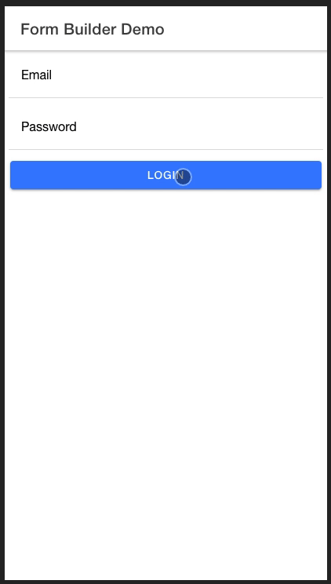
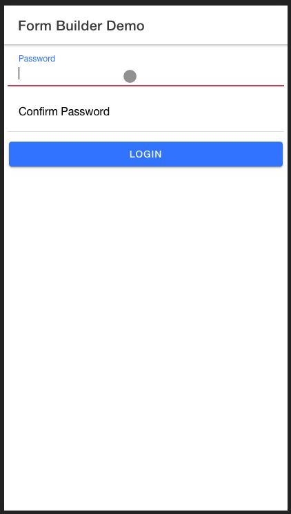
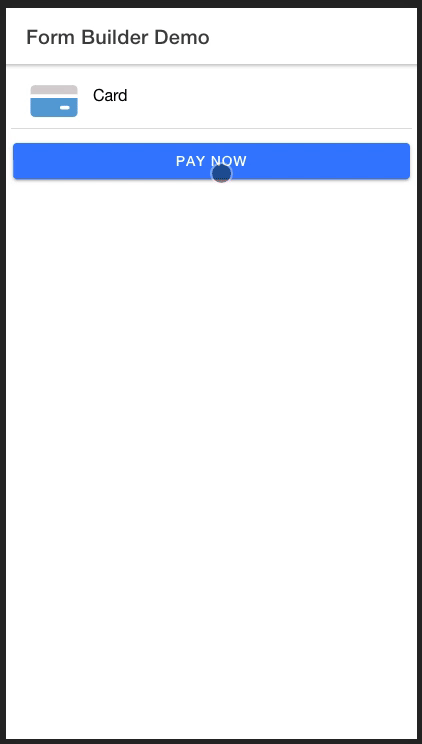

# Ionic Custom Form Builder

This is an ionic-angular component library for building forms with the highlight of doing form validation so you don't have to.

[](https://www.npmjs.org/package/ion-custom-form-builder)


Features (Current Version)
  - [Email Validation](#usage-example)
  - [Password Validation](#password-validation-usage-example)
  - [Credit Card Validation (With support for detecting card type)](#credit-card-validation)
  - [Set Success or Error Validation Colors](#css-styling)
  - [Set errors to specific fields](#Set-Field-Error-on-Network-Callback)
  - Inline Form Fields
  - Text Area Form Fields
  - Use Official Ionic Icons

Upcoming Features
  - Credit Card Expiration Validation
  - Date Validation With Auto Correction
  - Radio and Checkbox support 
  - Dropdowns (Ion Select support)
  - Toggle buttons


# Usage Example Output



# Installation

In your project root, run

```txt
npm i ion-custom-form-builder@latest
```

# Usage Example

Lets walk through a *getting started* example that will show you how to setup the component in your project

import the module in your top level *.module.ts file

```ts
...
import { IonCustomFormBuilderModule } from 'ion-custom-form-builder';
...

@NgModule({
  imports: [
    ...
    IonCustomFormBuilderModule.forRoot()
    ...
  ]
})

...
```

Now in your *.page.html file add

```html
...
  <ion-custom-form-builder
    [formFields]="fields"
    [submitButtonText]="'Submit'"
    (formSubmission)="submitForm($event)" 
  >
  </ion-custom-form-builder>
...
```

Head over to your  *.page.ts file and add

```ts

  ...
  import { FormField } from 'ion-custom-form-builder';
  import { AbstractControl, Validators } from '@angular/forms';
  ...

  fields: FormField[] = [];
  email: AbstractControl;
  password: AbstractControl;

  constructor() {
    this.fields = [
      {
        icon: 'mail',
        type: 'email',
        title: 'Email',
        formControlName: 'email',
        control: this.email,
        validators: [Validators.required]
      },
      {
        icon: 'lock',
        type: 'password',
        title: 'Password',
        formControlName: 'password',
        control: this.email,
        validators: [Validators.required]
      }
    ];
  }

  submitForm(formData) {
    console.log('FORM_DATA=,', formData);
  }

  ...

```

The FormField interface has the following structure with some important notes

```ts
/*
* icon: ion-icon name
*
* title: Form field label
*
* formControlName: Used to identify the field by angular form builder
*
* control: Form field controller holds form input data
*
* validators: An array of validators ie [Validators.required, Validators.minLength(10) . . ] full list of form validators in angular docs
*
* type: i.e <input type="text"> | support 'email', 'number', 'password', 'text', 'tel'
*
* placeholder: form field placeholder
*
* formFieldValue: preset formField value
*
* formFieldType: Current version supports 'inline' and 'textarea'
*
* textAreaRowCount: The height in rows if formFieldType === 'textarea'
*
* errors: A boolean for whether or not form field has additional errors apart from validation errors i.e errors applied on a network callback
*
* labelPosition: supported => 'floating', 'stacked', 'fixed'
*/
export interface FormField {
    icon?: string;
    title: string;
    formControlName: string;
    control: AbstractControl;
    validators: Validators[];
    type: string;
    placeholder?: string;
    formFieldValue?: string;
    formFieldType?: string;
    textAreaRowCount?: number;
    errors?: boolean;
    labelPosition?: string;
}

```

# Css Styling

By default the form builder component has the following css classes applied on Success or Error Validations

```css
.default-form-input {
  border: 1px solid #007bff;
  border-radius: 0.5rem;
  margin-top: 16px;
  width: 80%;
}

.default-form-input-error {
  border: 1px solid #dc3545;
}

.default-form-input-success {
  border: 1px solid #28a745;
}
```

In order to get your own colors on Success or Error Validations, you can override the defaults by placing your css classes in the **global.scss** file

**IMPORTANT**

Use the following rules when you override the css classes 

If you override any of the classes, you have to include all the original class properties and set them as important 

e.g
```css
.override-default-form-input{
  border: 1px solid your_new_color !important;
  border-radius: your_new_border_radius !important;
  margin-top: your_new_border_margin !important;
  width: your_new_border_width !important;
}

```

For success and error classes, only override the border class property

**NOTE**

You can use your own custom made css that does not follow the above structure to style the form fields since internally the DOM structure is made up of official ion-components.

In that case you do not have to override the defaults ,simply pass in your own custom css class name using one of the **applying Css methods** below


# Applying Css Styling
<h2>Method 1: add the classes as module configuration options</h2>

```ts
...
import { IonCustomFormBuilderModule } from 'ion-custom-form-builder';
...

@NgModule({
  imports: [
    ...
    IonCustomFormBuilderModule.forRoot({
      defaultCssClass: 'override-default-form-input',
      errorCssClass: 'override-default-form-error',
      successCssClass: 'override-default-form-success'
    })
    ...
  ]
})
...
```


<h2>Method 2: Use component Inputs</h2>

```html
...
  <ion-custom-form-builder
    [formFields]="fields"
    [submitButtonText]="'Submit'"
    [defaultCssClass]="override-default-form-input'"
    [errorCssClass]="'override-default-form-error'"
    [successCssClass]="'override-default-form-success'"
    (formSubmission)="submitForm($event)" 
  >
  </ion-custom-form-builder>
...
```

# **Advanced Features**

  - Password Validation
  - Set errors to specific fields on network calls
  - Credit Card Validation

# Working with passwords

**Usage Example Output**



The ion-form-builder component provides you with an elegant way to validate passwords by doing the following

# Password Validation Usage Example

Head over to your  *.page.ts file and add

For this work you need to explicitly use **password** and **confirm_password** as your fromControlName & AbstractControl variable name

```ts

  ...
  import { FormField } from 'ion-custom-form-builder';
  import { AbstractControl, Validators } from '@angular/forms';
  ...

  fields: FormField[] = [];
  password: AbstractControl;
  confirm_password: AbstractControl;

  constructor() {
    this.fields = [
      {
        icon: 'lock',
        type: 'password',
        title: 'Password',
        formControlName: 'password',
        control: this.password,
        validators: [Validators.required]
      },
      {
        icon: 'lock',
        type: 'password',
        title: 'Confirm Password',
        formControlName: 'confirm_password',
        control: this.confirm_password,
        validators: [Validators.required]
      }
    ];
  }
  ...

```

# Credit Card Validation

ion-custom-form-builder comes with the ability to validate credit cards thanks to [Payform Library](https://github.com/jondavidjohn/payform)

**Usage Example Output**



# Credit Card Validation Usage Example

in your *.page.ts file , create a **FormField** array object with a **formFieldType** of **'card'**


```ts
...
  fields: FormField[] = [];
  card: AbstractControl;

  constructor() {
    this.fields = [
      {
        type: 'number',
        title: 'Card Number',
        formControlName: 'card',
        control: this.card,
        validators: [Validators.required],
        formFieldType: 'card',
        labelPosition: 'stacked'
      }
    ];
  }
...
```


# Set Field Error on Network Callback

<h2>Scenario</h2>

Say you are working on a login form and you want to set errors to your form fields when the user has entered the incorrect credentials

In your *.html file use the input **[errorsIndex]** that takes in an array of indices representing the index of the field to which you want to set an error


```html
...
  <ion-custom-form-builder
    [formFields]="loginForm"
    [submitButtonText]="'Login'"
    (formSubmission)="doLogin($event)"
    [errorsIndex]="loginErrors"
  >
  </ion-custom-form-builder>
...
```

In your *.ts file, lets assume you have some api that handles login.

Init an array **loginErrors**

When you encounter an error, say your api throws back a 401 error, you want to push the indices of the email and password fields into your **loginErrors** array

the result will be the email and password applying the error css class notifying the user that something is wrong with the login credentials


```ts
...
  loginForm: FormField[] = [];
  email: AbstractControl;
  password: AbstractControl;
  loginErrors: any[] = [];
...

  constructor(
    private api: HttpServiceProvider,
  ) {
    this.loginForm = [
      {
        icon: 'mail',
        type: 'email',
        title: 'Email',
        formControlName: 'email',
        control: this.email,
        validators: [Validators.required]
      },
      {
        icon: 'lock',
        type: 'password',
        title: 'Password',
        formControlName: 'password',
        control: this.email,
        validators: [Validators.required]
      }
    ];
  }

  doLogin(formData) {
    this.api.login(formData).then( response => {
      // Some success logic 
    }).catch( error => {
      // We know email and password fields are at index 0 and 1 respectively for the purpose of this example
      // You could have some intelligent logic to determine fields to which you want errors applied 
      this.loginErrors = [0, 1];
      loader.dismiss();
    });
  }
...
```