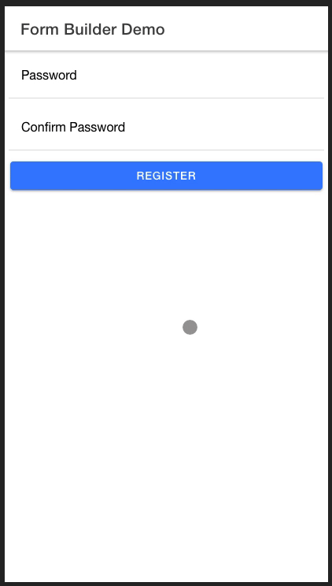

# Ionic Custom Form Builder

This is an ionic-angular component library to simplify and eliminate some redundancies of building forms when developing ionic apps.

[](https://www.npmjs.org/package/ion-custom-form-builder)


Features (Current Version)
  - [Email Validation](#Usage-example-output)
  - [Password Validation](#working-with-passwords)
  - [Credit Card Validation (With support for detecting card type)](#credit-card-validation)
  - [Implement Your Own Submit Button](#Implement-your-own-submit-button)
  - Ionic form field types included
    - ion-input
    - ion-textarea
    - ion-datetime (coming-soon)
    - ion-select (coming-soon)
    - ion-checkbox (coming-soon)
    - ion-radio (coming-soon)
    - ion-toggle (coming-soon)
    - ion-range (coming-soon)
  - Use Official Ionic Icons
  - [Set errors to specific fields](#Set-errors-to-specific-fields) (in-development)
  - [Css Styling](#Css-styling) (in-development)


Upcoming Features
  - Credit Card Expiration Validation
  - Date Validation With Auto Correction
  - File Input

# Usage Example Output


# Installation

In your project root, run

```txt
npm i ion-custom-form-builder@latest
```

# Usage Example

Lets walk through a *getting started* example that will show you how to setup the component in your project

import the module in your top level *.module.ts file

```ts
...
import { IonCustomFormBuilderModule } from 'ion-custom-form-builder';
...

@NgModule({
  imports: [
    ...
    IonCustomFormBuilderModule.forRoot()
    ...
  ]
})

...
```

Now in your *.page.html file add

```html
...
  <ion-custom-form-builder
    [formFields]="fields"
    [submitButtonText]="'Login'"
    (formSubmission)="onIonCfbFormSubmission($event)"
  >
  </ion-custom-form-builder>
...
```

Head over to your  *.page.ts file and add

```ts

  ...
  import { FormField } from 'ion-custom-form-builder';
  import { Validators } from '@angular/forms';
  ...

  fields: FormField[] = [];

  constructor() {
    this.fields = [
      {
        icon: 'mail',
        type: 'email',
        title: 'Email',
        formControlName: 'email',
        validators: [Validators.required, Validators.email],
        validationMessages: [
          {
            type: 'required',
            message: 'Email is required'
          },
          {
            type: 'email',
            message: 'Email is incorrect'
          }
        ]
      },
      {
        icon: 'lock-closed',
        type: 'password',
        title: 'Password',
        formControlName: 'password',
        validators: [Validators.required],
        validationMessages: [
          {
            type: 'required',
            message: 'Password is required'
          }
        ]
      }
    ];
  }

  onIonCfbFormSubmission(formData) {
    console.log('FORM_DATA=,', formData);
  }

  ...

```

Serve your app to see it in action

```txt
ionic serve
```

# FormField model

The FormField interface has the following structure with some important notes

```ts
import { AsyncValidatorFn, ValidatorFn } from '@angular/forms';

export interface FormField {
    /**
     *
     *
     * @type {string}
     * @memberof FormField
     */
    icon?: string;

    /**
     *
     *
     * @type {string}
     * @memberof FormField
     */
    title: string;

    /**
     *
     *
     * @type {string}
     * @memberof FormField
     */
    formControlName: string;

    /**
     *
     *
     * @type {Validators[]}
     * @memberof FormField
     */
    validators?: ValidatorFn[];

    /**
     *
     *
     * @type {AsyncValidator}
     * @memberof FormField
     */
    asyncValidators?: AsyncValidatorFn[];


    /**
     *
     *
     * @type {string}
     * @memberof FormField
     */
    type: string;

    /**
     *
     *
     * @type {string}
     * @memberof FormField
     */
    placeholder?: string;

    /**
     *
     *
     * @type {*}
     * @memberof FormField
     */
    value?: any;

    /**
     *
     *
     * @type {string}
     * @memberof FormField
     */
    formFieldType?: string;

    /**
     *
     *
     * @type {number}
     * @memberof FormField
     */
    textAreaRowCount?: number;

    /**
     *
     *
     * @type {string}
     * @memberof FormField
     */
    labelPosition?: string;

    /**
     *
     *
     * @type {ValidationMessage []}
     * @memberof FormField
     */
    validationMessages?: ValidationMessage []
}

export interface ValidationMessage {
  type: string;
  message: string;
}
```

# Css Styling

- In Development

# **Advanced Features**

  - Password Validation
  - Set errors to specific fields on network calls
  - Credit Card Validation

# Working with passwords

**Usage Example Output**



The ion-form-builder component provides you with an elegant way to validate passwords by doing the following

# Password Validation Usage Example

Head over to your  *.page.ts file and add

In your *.page.ts file , create  **FormField** array objects with **formFieldType** of **'password'** & **'confirm-password'**

```ts

  ...
  import { FormField } from 'ion-custom-form-builder';
  import { Validators } from '@angular/forms';
  ...

  fields: FormField[] = [];

  constructor() {
    this.fields = [
      {
        icon: 'lock-closed',
        type: 'password',
        title: 'Password',
        formControlName: 'password',
        validators: [Validators.required],
        asyncValidators: [this.passwordValidator],
        validationMessages: [
          {
            type: 'required',
            message: 'Password is required'
          },
          {
            type: 'passwordValidator',
            message: 'Passwords do not match'
          }
        ],
      },
      {
        icon: 'lock-closed',
        type: 'password',
        title: 'Confirm Password',
        formControlName: 'confirm-password',
        validators: [Validators.required],
        asyncValidators: [this.confirmPasswordValidator],
        validationMessages: [
          {
            type: 'required',
            message: 'Please confirm your password'
          },
          {
            type: 'confirmPasswordValidator',
            message: 'Passwords do not match'
          }
        ]
      }
    ];
  }
  ...

  /**
   * Validates password against password confirmation
   *
   * @param {AbstractControl} control
   * @return {*}  {Promise<any>}
   */
  passwordValidator(control: AbstractControl): Promise<any> {
    if (!control.parent) {
      return Promise.resolve(null)
    }else if (control?.parent.get('confirm-password')?.value && control?.value !== control?.parent.get('confirm-password')?.value) {
      control.markAsTouched({ onlySelf: true });
      return Promise.resolve({ passwordValidator: { valid: false } });
    }else {
      if (control?.parent.get('confirm-password')?.invalid) {
        control?.parent.get('confirm-password')?.updateValueAndValidity({ onlySelf: true });
      }
      return Promise.resolve(null)
    }
  }


  /**
   * validates password confirmation against password
   *
   * @param {AbstractControl} control
   * @return {*}  {Promise<any>}
   */
  confirmPasswordValidator(control: AbstractControl): Promise<any> {
    if (!control.parent) {
      return Promise.resolve(null)
    }else if (control?.parent.get('password')?.value && control?.value !== control?.parent.get('password')?.value) {
      control?.parent.get('password')?.updateValueAndValidity({ onlySelf: true });
      return Promise.resolve({ confirmPasswordValidator: { valid: false } });
    }else {
      control?.parent.get('password')?.updateValueAndValidity({ onlySelf: true });
      return Promise.resolve(null)
    }
  }
  ...

```

# Credit Card Validation

ion-custom-form-builder comes with the ability to validate credit cards thanks to [Payform Library](https://github.com/jondavidjohn/payform)

**Usage Example Output**


# Credit Card Validation Usage Example

**IMPORTANT**

First you need to add the following in the assets array of your angular.json file, this will map library's
assets to your project assets folder


```json
  ...
  "architect": {
    "build": {
      "options": {
        "assets": [
          {
            "glob": "**/*",
            "input": "node_modules/ion-custom-form-builder/src/assets",
            "output": "assets"
          }
        ]
      }
    }
  }
  ...
```

In your *.page.ts file , create a **FormField** array object with a **formFieldType** of **'credit-card'**

```ts
...
  fields: FormField[] = [];

  constructor() {
    this.fields = [
      {
        type: 'number',
        title: 'Card',
        formControlName: 'card',
        formFieldType: 'credit-card',
        validators: [Validators.required],
        validationMessages: [
          {
            type: 'required',
            message: 'Credit card number is required'
          }
        ]
      }
    ];
  }
...
```

Serve your app again to see the changes

```txt
  ionic serve
```

# Set Errors to Specific Fields

- In Development

# Implement Your Own Submit Button

You are able to implement your own submit button in case you want content in-between your form and submit button

In your *.page.html file where you put the ion-custom-form-builder component ..

```html
...
<ion-content>
  <ion-custom-form-builder
    [formFields]="fields"
    [showSubmitButton]="false"
    (formSubmission)="onIonCfbFormSubmission($event)">
  </ion-custom-form-builder>
  ...
  <ion-row>
    <ion-col>
      <ion-button expand="block" color="primary" (click)="onClickMyOwnSubmitButton()">
        Submit
      </ion-button>
    </ion-col>
  </ion-row>
</ion-content>
...
```

Then in your *.page.ts file import the IonCustomFormBuilderService..

```ts
  ...
  import { IonCustomFormBuilderService } from 'ion-custom-form-builder';
  ...

  constructor(
    private ionCfbService: IonCustomFormBuilderService
  ) {
  ...
  }

  ...

  /**
   * Triggered by the form submission event
   *
   * @param {*} formData
   */
  onIonCfbFormSubmission(formData) {
    console.log('FORM_DATA=,', formData);
  }

  /**
   * Trigger form submission using IonCustomFormBuilderService
   *
   */
  onClickMyOwnSubmitButton() {
    this.ionCfbService.triggerFormSubmission$.next(true)
  }
  ...
```
